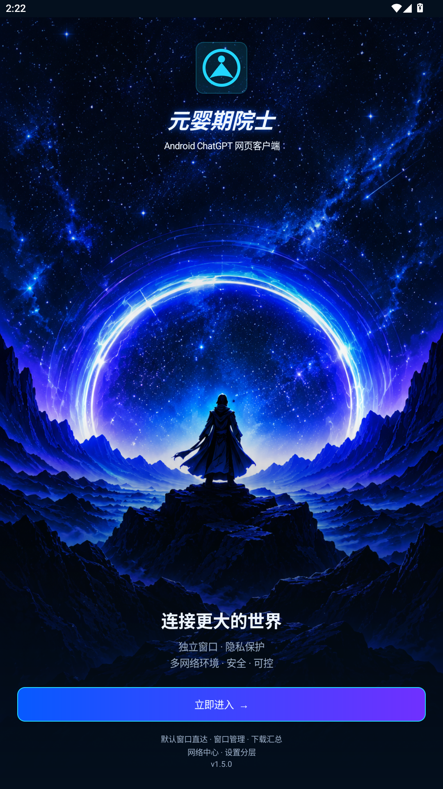
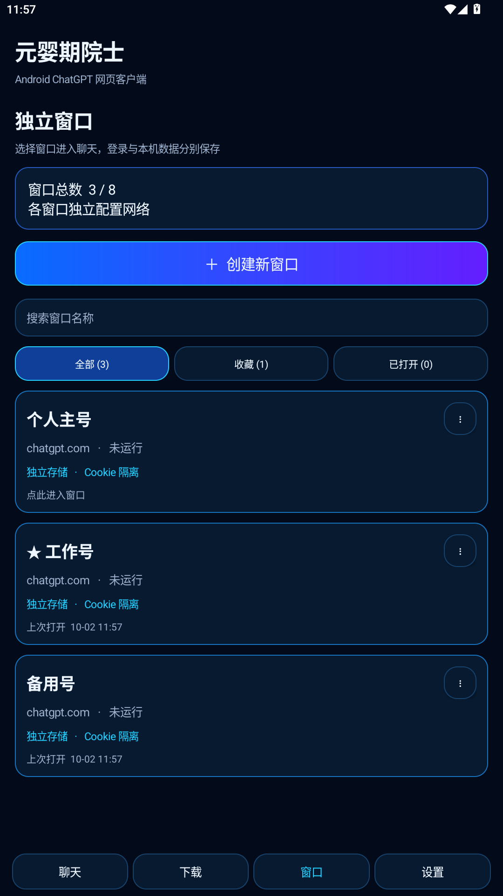

# 元婴期院士 · Yuanying Chat

Android ChatGPT 网页客户端，支持独立登录窗口、简洁与原网页聊天、文件下载、后台等待，以及按环境配置的网络和隐私保护。

**当前版本：1.5.12（versionCode 38，原版签名环境管理与使用体验更新）。**

## 下载与安装

- [下载 1.5.12 正式应用 APK（ARM64）](https://github.com/Ararataki-number-one/yuanying-chat/releases/download/v1.5.12-gecko/PocketChat-1.5.12-gecko-arm64.apk)
- [上一版 1.5.11 正式应用 APK（ARM64）](https://github.com/Ararataki-number-one/yuanying-chat/releases/download/v1.5.11-gecko/PocketChat-1.5.11-gecko-arm64.apk)
- [上一版 1.5.10 正式应用 APK（ARM64）](https://github.com/Ararataki-number-one/yuanying-chat/releases/download/v1.5.10-gecko/PocketChat-1.5.10-gecko-arm64.apk)
- [上一版 1.5.9 正式应用 APK（ARM64）](https://github.com/Ararataki-number-one/yuanying-chat/releases/download/v1.5.9-gecko/PocketChat-1.5.9-gecko-arm64.apk)
- [上一版 1.5.8 正式应用 APK（ARM64）](https://github.com/Ararataki-number-one/yuanying-chat/releases/download/v1.5.8-gecko/PocketChat-1.5.8-gecko-arm64.apk)
- [上一版 1.5.7 Firefox 内核更新 APK（ARM64）](https://github.com/Ararataki-number-one/yuanying-chat/releases/download/v1.5.7-gecko/PocketChat-1.5.7-gecko-arm64.apk)
- [上一版 1.5.6 电脑版阅读优化 APK](https://raw.githubusercontent.com/Ararataki-number-one/yuanying-chat/477353188f4af649055bae7a1235b03e7c221fd9/public-downloads/PocketChat-1.5.6-desktop-reading.apk)
- [历史 1.5.0 APK](https://github.com/Ararataki-number-one/yuanying-chat/releases/download/v1.5.0/YuanyingChat-v1.5.0.apk)
- [查看 Releases](https://github.com/Ararataki-number-one/yuanying-chat/releases)

原发布 1.5.0 和上一轮原签名预览包可直接覆盖安装，无需卸载。此前临时签名预览包使用不同证书，不能直接覆盖。

Firefox 新内核首次需要重新登录。原系统内核的登录数据保留，可从“会话 → 更多 → 浏览器内核”切回。Firefox 当前用于原网页，简洁模式会重新打开系统内核；两种内核分别保存登录。真实 Google / ChatGPT 登录和 ARM 手机兼容性仍需设备验收。

安卓 8.0 起可使用默认窗口；安卓 9.0 起支持最多 8 个独立窗口。内置网络组件支持 ARM64 和 x86_64。

## 功能

| 部分 | 已实现内容 |
| --- | --- |
| 环境管理 | 首次品牌页进入后默认直达指定窗口原网页；创建、删除、分组、备注、搜索、收藏、筛选与排序；多选、批量分组与收藏；最多 8 个环境 |
| 独立环境 | 分开的浏览器登录目录、Cookie、本机聊天与草稿、偏好和加密网络配置；Firefox 与系统内核各自保留登录 |
| 网页显示 | 创建环境时选择手机版 / 电脑版；已有环境在浏览器设置中修改，按环境独立保存；电脑版缩放记忆、适应屏幕与输入安全区 |
| 聊天 | 简洁与原网页模式、模型与强度选择、Markdown、数学公式、代码、消息复制与分享 |
| 会话与草稿 | 聊天侧边栏、历史同步、会话改名与删除、草稿冲突处理和恢复、阅读位置恢复 |
| 附件 | 图片与文件上传状态、重新上传、移除、图片与 PDF 本地预览 |
| 下载 | 自动保存、同名编号、暂停与续传、跨窗口文件列表、打开、分享、另存为 |
| 应用更新 | 每天自动检查、可选 Wi-Fi 自动下载、后台下载与取消/重试、原签名覆盖安装确认 |
| 后台等待 | 等待与完成通知、发送状态恢复；重新连接不会自动重发提问 |
| 网络管理 | 全部窗口网络、订阅与固定出口三栏；候选编辑后保存并应用；勾选池随机 / 手动入口；原完整线路测速与出口核验；节点名称地区提示与实际出口 IP 地区查询；回复期间保存候选，结束后应用 |
| 隐私与自检 | 系统内核保留三档保护与原自检；Firefox 使用原生跟踪保护并关闭 WebRTC，强化档启用官方原生抗指纹；支持当前页面公共浏览器信息自检；系统内核脚本检测标为未覆盖 |
| 偏好 | 草稿、历史、滚动位置、后台与通知开关、仅 Wi-Fi 下载、旧临时文件清理 |

当前平台是 ChatGPT。模型和网页可用功能由当前登录账号及网页实际提供。软件通过内置网页登录，不要求填写 API Key。

独立“记录”主页面已移除，会话历史仍在聊天侧边栏中。

安卓 10+ 默认下载目录为 `Download/元婴期院士/窗口_编号/`；安卓 8–9 保存到对应窗口的应用内文件目录，可打开、分享或另存为。

1.5.12 增加节点地区识别、环境删除与回复期间保存配置；压缩会话顶部，修正等待完成与网络管理状态，接入 Firefox 原生强化保护。见 [逐文件修改说明](docs/CHANGELOG-v1.5.12.md) 与 [构建、Android 和公网验证](verification/environment-management-v1.5.12/README.md)。

1.5.11 新增每天自动检查、Wi-Fi 自动下载选项、后台下载、取消/重试和原签名覆盖安装入口。见 [更新使用说明](docs/APP-UPDATES.md) 与 [构建、Android 和公网验证](verification/app-updates-v1.5.11/README.md)。

1.5.10 修复 Firefox 文本附件读取、原生文件下载、页面遮挡、自检接入、编辑返回和版本显示。见 [逐文件修改说明](docs/CHANGELOG-v1.5.10.md) 与 [构建及 Android 验证](verification/browser-experience-v1.5.10/README.md)。手机版真机官网白屏仍需验收。

1.5.9 允许电脑版缩小到 60%，实际缩小与放大均不刷新网页；修复独立进程的前后台生命周期，按环境保存会话 Cookie 和 SDK 页面状态，网页关闭后有限次自动恢复，并保留手动重试。退出登录和清理会更新 Cookie 保存记录。见 [逐文件修改说明](docs/CHANGELOG-v1.5.9.md) 与 [编译、Android 回归及原签名验证](verification/browser-experience-v1.5.9/README.md)。

1.5.8 保留电脑版浏览器身份，按手机宽度排版，取消整张桌面页面缩小的初始显示；网站自行响应屏幕，正文与输入框更易阅读。缩放在各环境分别保存，旧设置换算一次。另完善子窗口返回、会话关闭后重新加载、旧页面请求清理和故障状态。见 [修改说明](docs/CHANGELOG-v1.5.8.md) 与 [编译、Android 回归及原签名验证](verification/browser-experience-v1.5.8/README.md)。

## 环境管理与功能设置

底部为会话、环境、下载、网络、设置。环境卡片突出名称、分组、网络状态和最近使用；支持多选、批量分组和收藏，全选只处理当前结果并提示筛选外的选择。环境编辑按基本信息、网络配置、浏览器和使用偏好组织。会话顶部的网络状态可直接定位当前窗口；网络页列出全部窗口，编辑网络使用居中弹窗，保存后才应用。应用设置继续控制全局入口与系统权限。

管理界面参考 AdsPower 的环境列表与分组配置思路，采用适合手机的卡片布局。1.5.3 增加入口订阅库，各窗口从所选订阅选择入口；自定义指纹、自动化等扩展能力沿用既有支持范围。

1.5.4 将“网页显示方式”放在新建环境的基本信息中；已有环境通过“编辑环境 → 浏览器”修改。默认手机版，电脑版继续加载真实 ChatGPT 网页并允许双指缩放。环境列表只在使用电脑版时显示一处小字提示；会话顶部不增加按钮。“简洁 / 原网页”仍控制聊天界面的显示，和手机版 / 电脑版分别保存。

1.5.5 修复加载、连接或等待重连时无法修改网页显示方式的问题；保存前重新读取当前网页，旧页面的忙碌状态不会一直阻止保存。登录跳转不再记作网络失败。Google 拒绝应用内浏览器时提供登录帮助；这是提示和状态修复，不能保证解除 Google 对 WebView 的登录限制。系统浏览器的账号会话不会自动同步回应用。

1.5.6 增加电脑版各环境的缩放记忆及“更多 → 网页缩放”。横竖屏按可用宽度恢复，键盘弹出时原网页会话暂时收起底部导航，关闭后恢复。保留真实网页，不修改模型、输入或消息界面。Google WebView 登录限制仍未解除；已完成保留隔离和各环境网络的内核替换源码评估，新内核尚未接入。

1.5.7 在正式应用内接入 Mozilla 官方 GeckoView，继续加载真实网页，沿用各环境网络配置和独立数据目录。新内核模式不初始化 Chromium；内核切换会重新打开当前环境。加载失败时可重试或选择系统内核。已验证受控网页存储和独立代理，但换内核不能保证解除 Google 的登录限制。

- [保留独立环境的浏览器内核迁移评估](docs/BROWSER-ENGINE-MIGRATION.md)
- [环境管理与配置结构](docs/ENVIRONMENT-MANAGEMENT.md)
- [下一轮 Android 电脑版 Chrome 扩展方案（尚未实现）](docs/ANDROID-DESKTOP-EXTENSIONS.md)
- [UI 与实际功能](docs/UI-FUNCTIONS.md)
- [统一交互规则与网络优化方向](docs/INTERACTION-AND-NETWORK.md)
- [品牌素材与提示词](docs/ASSETS.md)
- [历史 1.5.0 界面预览](docs/screenshots)

## 历史界面资料

下图为 1.5.0 旧版界面，使用独立测试数据。当前管理界面已重组，以环境管理说明为准：

 

## 构建和验证

- [构建说明](docs/BUILD.md)
- [1.5.7 正式应用内核：逐文件修改说明](docs/CHANGELOG-v1.5.7.md)
- [1.5.7 原生浏览器验证及验收边界](verification/gecko-production/README.md)
- [1.5.6 电脑版阅读：逐文件修改说明](docs/CHANGELOG-v1.5.6.md)
- [1.5.5 浏览器设置与登录提示：逐文件修改说明](docs/CHANGELOG-v1.5.5.md)
- [1.5.4 环境网页显示：逐文件修改说明](docs/CHANGELOG-v1.5.4.md)
- [1.5.3 会话与网络界面：逐文件修改说明](docs/CHANGELOG-v1.5.3.md)
- [1.5.2 交互优化说明](docs/CHANGELOG-v1.5.2.md)
- [1.5.1 更新说明](docs/CHANGELOG-v1.5.1.md)
- [历史 1.5.0 更新说明](docs/CHANGELOG-v1.5.0.md)
- [界面与功能对应](docs/UI-FUNCTIONS.md)
- [本轮电脑版阅读验证：主机与 Chromium 通过，真机待验证](verification/desktop-reading/README.md)
- [上一轮浏览器设置与登录提示验证：76 项主机检查通过，真机待验证](verification/browser-settings-login/README.md)
- [上一轮环境网页显示验证：43 项主机检查通过，真机待验证](verification/environment-browser-display/README.md)
- [上一轮会话与网络验证](verification/chat-network-reference/README.md)
- [上一轮交互验证](verification/interaction-round3/README.md)
- [上一轮环境管理与覆盖更新验证](verification/environment-management-round2/README.md)
- [第一轮环境管理验证：28 项原生检查通过；网页回归未完成](verification/environment-management/README.md)
- [历史 1.5.0 验证摘要：578 项检查、8 次熄屏测试](verification/validation-summary.json)
- [逐项结果](verification/test-results)
- [工程实现记录](docs/ENGINEERING-HISTORY.md)

验证使用独立测试包、本地拦截网页样本和安卓 15 测试实例，未登录真实账号。旧安卓保存后端在该实例中测试，未声称完成安卓 8–9 真机验证。

保护与自检只覆盖列出的路径，不能保证 VPN 不被识别、所有网络路径无泄漏或账号不会被封。实际网络自检需要当次授权，不默认后台访问公开检测服务。

## 仓库内容

`app/` 为应用源码和资源，`libs/` 为构建依赖，`tests/` 为隔离测试，`third-party/` 保留第三方许可与对应源码，`verification/` 为验证材料。

签名密钥、账号会话、个人网络凭据和个人预设不在仓库。自行构建发布包默认未签名；使用不同密钥签名后，无法覆盖已有原签名发布包。

## 许可

第三方组件保留各自许可与署名，见 [third-party](third-party/README.md)。本项目自有源码暂未另行声明开源许可证。
