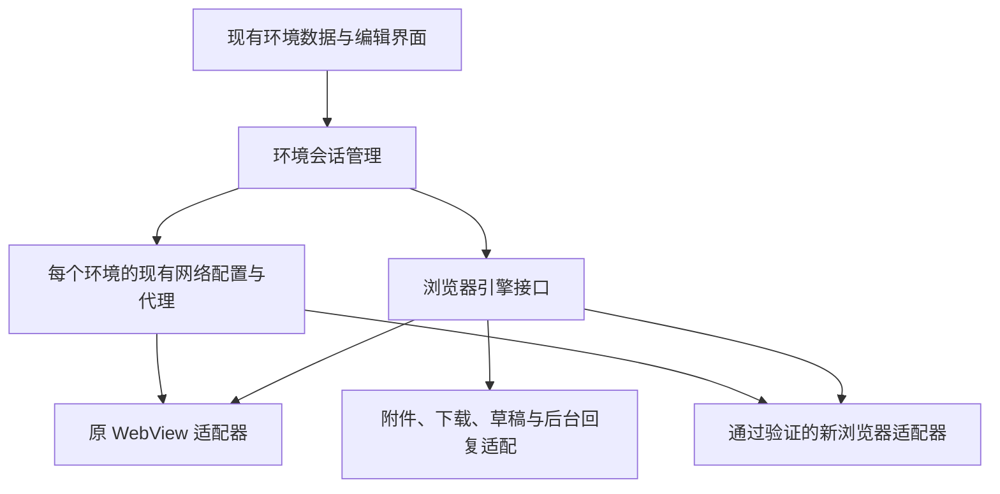

# 保留独立环境的浏览器内核迁移评估

评估日期：2026-10-03。用户确认必须保留应用内独立登录环境和每个环境的网络配置。插件和网络功能开发保持暂停；本文件评估浏览器替换，不代表已经替换或修复 Google 登录。

## 登录问题的边界

现有电脑版仍是 `android.webkit.WebView`，桌面 UA、1024 视口和缩放属于网页显示设置。用户反馈 1.5.5 之后仍不能登录，截图为 Google 的“此浏览器或应用可能不安全”。上一版修复的是保存阻塞和登录等待被误判为网络失败，没有解除身份提供方对应用内浏览器的限制。

从应用侧替换渲染内核并不保证 Google 接受这个客户端。需要验证完整浏览器的登录流程、身份提供方跳转及真实账号；不能用改 UA、伪造 Chrome 品牌、关闭证书验证或复制系统浏览器 Cookie 当作成功。这里是第三方 ChatGPT 网站的登录，项目没有这个站点 OAuth 客户端和回调控制权，不能直接接入一个原生 OAuth 库便获得同一站点会话。

用户已要求保留隔离，因此普通外部 Chrome 和 Custom Tabs 不作为替代实现：它们不继承现有环境的登录目录或应用专用代理。只开放外部入口不能完成这次要求。

## 源码评估结果

| 路线 | 本次确认的能力 | 仍未确认的能力 | 判断 |
| --- | --- | --- | --- |
| Android System WebView | 当前环境目录、代理和功能已经围绕它实现 | 用户当前 Google 登录仍被拒绝；桌面显示不改变内核类型 | 保留旧环境用于回退，继续 UA 修补不能作为根本修复 |
| GeckoView | 官方预编译 AAR 已集成；双 context 存储隔离、重启持久化、按环境清理与固定 SOCKS 测试通过 | Google / ChatGPT 真账号登录；项目每环境代理与 DNS / worker 路由；下载、附件和后台业务适配 | 独立实验已运行，代理事件仍缺少环境标识；不直接接入正式环境 |
| Chromium 完整浏览器层 | 官方 Android 构建路径；桌面 Android / 扩展代码存在，详见原扩展评估 | 当前没有可嵌入完整浏览器 SDK、ARM64 产物和实际登录验证；不能把扩展开关当兼容证据 | 更符合长期 Chromium / Chrome 扩展方向，但需要内核构建与维护投入 |
| Kiwi 或未核验的第三方内核 | 已有旧源码可读 | 维护、安全更新、版本与真实登录兼容性未得到证明 | 不使用停止维护或来源不明的内核补丁 |

早期 GeckoView 源码评估锁定 `bf9757d91e2e53b8ab836f2a08bf4c0275fdcd23`；当前实测 SDK 官方 POM 对应源码 revision 为 `8eb25af4acf031ab1e06abf1a912275083c820ed`。`GeckoSessionSettings.contextId` 的文档明确说明分隔 Cookie 与 localStorage；这不代表每个 context 自动得到不同代理。`GeckoRuntime` 限制单个运行进程只创建一个 runtime，不能在同一进程创建多个 runtime 来假装网络隔离。配置文件接口被上游描述为调试配置，不能仅依赖这个入口就宣称生产环境代理可用。

上游内置扩展接口 `ensureBuiltIn` 和 native messaging 可用于迁移项目已有网页观察代码；用户自定义插件仍暂停。Gecko 扩展安装文档要求 Mozilla 签名 `.xpi`，因此这条路线不能承诺直接安装 Chrome 商店 `.crx`。若以后仍要求原生 Chrome 扩展，应优先继续完整 Chromium 的验证。

## 建议的架构

先将环境数据与浏览器引擎解耦，再接入通过验收的新引擎。当前正式 APK 继续使用原 WebView，已有 Cookie 和目录保持；新引擎使用独立目录，需要重新登录，不能无感搬运旧会话。

接口必须覆盖真实页面视图、桌面模式与缩放、导航和页面事件、可信站点 JavaScript / 消息、登录存储、上传选择、下载及网络暂停能力。`ChatSession` 负责现有任务和环境状态，具体内核负责执行；会话页只负责呈现。没有实现的能力应明确不支持，不能使用空回调或只保存一个开关。

源码中直接依赖 WebView 的部分涉及 `ChatSession`、`MainActivity`、`BrowserPrivacy`、`BrowserNetworkGuard`、`WebReplyObserver`、`Attachments`、`FileDownloads`、`PageMemory`、`PocketApplication` 和环境自检等。新引擎必须把现有网页驱动、下载和观察代码通过对应 API 接入，不能只替换一个 View。

保留现有最多 8 个环境的进程映射。Gecko 技术验证可先使用环境 1 与 2 的独立进程、独立 profile 目录，验证真实隔离；仅 `contextId` 验证不足以替代每环境网络测试。进程映射也不自动证明引擎子进程、native libraries、profile 路径或代理都隔离，必须检查实际请求。

## 迁移门槛

先交付与正式包隔离的最小实验浏览器，验证两个环境；通过后才接入整个应用。

1. **登录**：ARM64 Android 真机完成 Google → ChatGPT 登录，退出、重启及切换环境后正确保持；测试 Google 普通登录、错误密码、拒绝和网络失败。账号信息只在官方页面输入，不记录表单和 Cookie。
2. **隔离**：两个环境登录不同账号；Cookie、localStorage、IndexedDB、Service Worker 与缓存互不共享。退出或删除一个环境不会影响另一个。
3. **网络**：复用各环境现有配置和 Mihomo / SOCKS5 链路；页面、重定向、DNS、WebSocket、worker 和下载均验证对应出口，禁止意外直连回退；更换入口不更换固定出口。此项是内核接入验收，不新增网络功能。
4. **真实网页操作**：官方标题、输入框、模型与消息保持，附件上传、下载、草稿和后台回复恢复可用；不能在 Google 登录页面注入网页驱动或隐私伪装脚本。
5. **迁移与回退**：新引擎选择先形成候选，保存后应用；任务进行中不迁移，旧 WebView 数据保留，回退可以继续使用。不得自动转移或清空登录数据。

## 官方预编译 SDK 实验更新（2026-10-03）

已取得 Mozilla 官方 GeckoView `157.0.20260924084938` AAR，241,700,764 bytes，SHA256 `25de06a6204382c08e405adc36da7373098bdc230d6d768f17a6fe971f0dece0`，与官方校验文件一致。新增独立 [engine-probe](../engine-probe/README.md) 项目；没有把 GeckoView 加入正式 APK，也没有修改正式 WebView 生命周期或环境目录。

当前发布 SDK 要求 Android 编译平台 37.1；已单独准备 JDK 17、Gradle 9.8.0 和 Android Build Tools 37.0.0，原生产 SDK 35 保留。本地 Java 测试 Activity 对真实 SDK 编译通过。完整 Gradle 依赖解析遇到 Maven Central 出口 IP 限流，因此使用仓库 CI；CI 的 APK 编译与 Android 35 原生测试已通过，本地完整 Gradle 构建仍受限。ARM64 实验包为 102,187,163 bytes（约 102 MB），可独立安装用于受控测试。

SDK 内实际打包的代理实现暴露一处迁移缺口：`getCookieStoreIdForOriginAttributes` 未处理 `geckoViewSessionContextId`。所以 `contextId` 分隔存储并不能保证 `proxy.onRequest.cookieStoreId` 能识别环境。实际双环境 Cookie、localStorage、IndexedDB、CacheStorage、Service Worker 隔离与持久化测试已通过；使用官方按环境清理 API 后，重启仍保持删除结果，另一环境数据保留。固定 SOCKS 路线的 DNS、重定向、WebSocket、worker 与断线不直连测试也通过。代理事件在两个环境均返回 `firefox-default`，Service Worker 请求 `tabId=-1`，不能将全局代理结果当作正式应用每环境代理通过。

实际结果和官方 SDK 证据见 [SDK 实验记录](../verification/android-engine-sdk/README.md)。Google / ChatGPT 真账号登录尚未测试；新 SDK 也不承诺直接安装 Chrome CRX。只有独立环境、正式线路和真机登录全部验收之后，才决定是否迁移。

## 1.5.6 当时的交付与访问限制（历史记录）

1.5.6 完成现有 WebView 的阅读优化和本次源码评估，**没有引入 GeckoView 或 Chromium 内核，也没有修复 Google 登录限制**。

当前云环境约 27 GiB 空闲磁盘；Chromium 官方文档要求至少 100 GB 空闲空间，所以没有启动完整 Chromium 源码构建。GeckoView 官方 Maven 元数据地址 `maven.mozilla.org` 在本环境返回网络代理 403，尚未取得和校验正式 AAR。继续 Gecko 实验需要该域名可访问，并需要真机登录验证；完整 Chromium 路线还需要更大的构建环境。当前没有请求或取得新的账号凭证。

用户补充自己使用的是 Windows／macOS 的 Roxy 浏览器，体验良好且内核包体较小。这里必须区分**已编译内核的运行包体**与**完整源码编译工作空间**；100 GB 是后者的官方要求，不是 Android 安装包大小，也不是所有换内核方案的要求。若找到成熟、来源可验证且接口合适的 Android 预编译 SDK，可以直接集成，不必自行构建完整 Chromium。后续优先验证这类 SDK；Windows／macOS 原生内核不能直接载入 Android APK。

官方 Chromium 文档要求 x86-64 Linux、至少 8 GB RAM，并强烈建议超过 16 GB；实际项目若自行编译，建议预留约 200 GB 可用磁盘和 32 GB RAM，200 / 32 是工程余量建议。当前内存不是主要阻塞，磁盘不足。用户的 Roxy 桌面体验不能证明其提供可嵌入 Android SDK，也不能直接证明第三方 Google 登录在本项目可用。尝试访问候选 `roxybrowser.com` 首页、下载和文档地址均被代理拒绝，尚未核验对应 SDK 或二进制来源，不下载或移植未验证内核。

Google OAuth 政策页面访问同样返回代理 403，本文件不声称已读取最新 Google 政策，也不保证换内核后登录成功。源码和资源证据见 [本次内核评估](../verification/browser-engine-migration/README.md)，此前 Chromium 文档及扩展源码检查见 [原扩展评估](../verification/chrome-extension-feasibility/README.md)。
