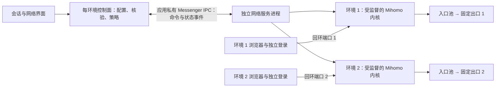

# 网络底层架构升级

目标：把浏览器生命周期与代理数据通道分离，稳定保留连接，再在这个底座上做延迟优化。入口优选、网站探测、DNS 调整见 [性能方案](NETWORK-PERFORMANCE-PLAN.md)。

## 分层

1. **数据面**：代理内核由专用 `:network` 前台服务持有，浏览器进程退出不会主动销毁内核。每环境独立内核、目录、端口、配置和控制密钥，避免共享连接池混淆代理身份。
2. **控制面**：沿用现有订阅解析、配置候选、入口策略、出口核验和保护开关，通过私有 IPC 启停对应环境。每个环境的启动 / 停止命令串行执行，不阻塞其他环境。
3. **事件面**：内核启动、就绪、退出通过 Messenger 主动通知。进程退出由 `waitFor` 监督，清理旧实例使用实例代号校验；不靠周期性猜测来识别内核死亡。

## 恢复与隔离

浏览器进程重新连接服务后，先比较配置指纹，再重新核验固定出口。一致时接管已运行的内核和原回环端口，保留代理连接；不一致时走明确的重启流程。检测到网络服务死亡时立即关闭网页网络准入，恢复完成前保持阻断，不回退直连。

删除环境时停止该环境的内核后再清数据；其他环境继续使用自己的内核。停止最后一个内核时退出前台通知。运行中的服务只显示一条简洁网络通知。

## 性能策略

已有可靠内核负责协议、DNS、连接复用和转发，应用负责连接监督和策略。低延迟入口优选、目标网站测速和 DNS 比较在这个分层上运行。正常测速使用独立候选监听器，不改真实浏览器路由。健康长连接不因刷新状态和测速而重建。

QUIC / Hysteria2 / TUIC 属于入口传输能力，需要订阅服务器支持。Mihomo 可使用它能解析的对应节点；不把普通 SOCKS 出口包装成 HTTP/3。固定出口的协议和服务器条件决定可用传输，应用重构不能消除物理距离。

## 本轮验收边界

- 真实 Android 的独立服务 PID 与内核 PID。
- 客户端断开 / 重建后复用同一内核与端口，再次核验出口。
- 两个环境同时运行；停止、删除一个不影响另一个。
- 内核实际退出事件及时到达客户端，旧实例事件不能覆盖新实例。
- 全部既有浏览器回归及性能策略回归；合成 HTTPS 证书仅在测试包使用。

这是本轮实际实现的架构边界。配置和网页忙碌判断仍在环境控制进程，不把整个管理界面的轮询称为已经事件化；真实用户线路的延迟收益另行实测。
