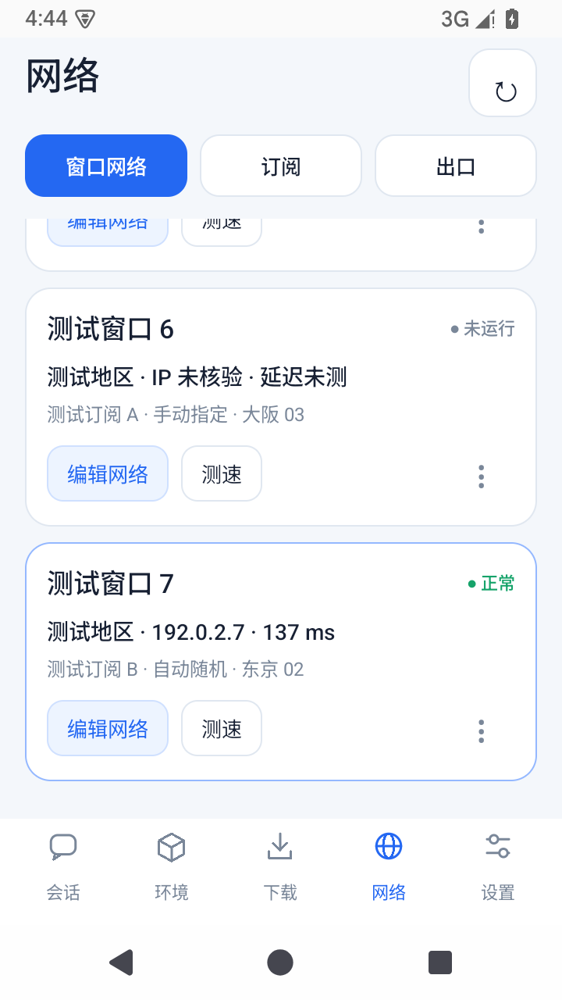

# 1.5.3 会话与网络界面验证

发布包和独立测试包编译、签名、zipalign 和版本核对通过。安装到模拟器的 APK 哈希与构建文件一致；源码输入哈希记录在 `built-source-files.json`。发布包没有加入参考 HTML、测试活动或网页夹具。

## 本轮结果

| 检查 | 结果 | 范围 |
| --- | --- | --- |
| 网络页面与候选配置 | 43 / 43 通过 | 真实 Mihomo 缓存解析与控制器；随机池 / 手动入口约束；三个 Tab、全部已创建窗口、居中弹窗；取消与候选不写入；过期候选拒绝；真实加密保存和第七窗口私有 IPC；其他窗口配置与聊天草稿保留。 |
| 原启动选路 | 22 / 22 通过 | 现有启动、恢复、记忆入口、固定出口不一致阻断等受控场景。 |
| 原恢复优先级 | 14 / 15，时延门槛未通过 | 实际本机阻塞 socket 的取消、线程池恢复、入口保留及出口核验。最终复测恢复 2,056 ms，超过原 800 ms 门槛；其余功能检查通过。 |
| 会话模式切换与网页草稿 | 未完成 | 本轮此前的 1.5.3 测试包未生成结果；WebView 渲染进程出现 SIGTRAP，随后宿主被 Chromium 终止。 |
| 原网页偏好重启保留 | 无法判定 | 观察到 1 / 3 的原始结果，但前置模式切换没有完成，原网页偏好没有按前置步骤写入，因此不能把该结果作为独立回归结论。原始结果保留。 |
| 模块切换与网页草稿 | 未完成 | 未生成完整结果；渲染进程及宿主原生崩溃记录见 `webview-native-crash.txt`。 |

最终 80 项网络相关检查中，79 项通过、1 项恢复时延门槛未通过。第一次恢复优先级测量为 1,330 ms，功能检查通过但未满足 800 ms 门槛；保留在 `network-priority-first-attempt.json`，没有放宽断言。完整网络场景首次 240 秒超时，延长等待后 267,507 ms 完成并通过当时的 41 项；增加手机网络状态检查后的最终场景 160,044 ms 完成，43 项通过。上述差异均保留在 `runtime-summary.json`。

测试连接夹具最初与真实网络单例初始化存在竞争，曾出现状态为空或读取旧入口。夹具注入改为在同一锁内完成，并明确设置测试网络方式；单独的 8 项跨窗口保存检查和最终完整场景均通过。此前 35 / 36 与 41 / 43 的失败记录保留在 `network-reference-fixture-first-attempt.json`、`network-reference-fixture-save-attempt.json`，没有调整产品保存逻辑或放宽断言。

启动选路最终首次运行是 21 / 22，出口核验顺序检查未通过；在原断言下复测 22 / 22，通过记录与首次原始结果同时保留。

恢复优先级最终首次运行恢复耗时为 1,456 ms，超过原 800 ms 门槛；首次记录保存在 `network-priority-final-first-attempt.json`，随后相同断言下复测为 2,056 ms，仍未达标；未放宽断言或把该项标记通过。

## 环境与边界

使用 Android 15 / API 35、x86_64、360 dp 宽的软件模拟器，未使用 KVM。为排查系统和进程启动超时，模拟器超时倍率设为 8 并重启 Android 框架；曾出现 System UI 无响应。WebView 原生崩溃的触发原因未在本轮确认。

另外安装了不包含项目代码的最小 WebView 探针，清除旧结果后重新启动，回报 `renderer-gone:didCrash=true`。该探针只加载本机测试文字并调用 JavaScript 桥，不访问账号或代理。当前实例的基础渲染回归也未能完成。

网络测试的 **订阅解析、控制器入口范围、加密配置读写与跨窗口分发是真实路径**。代理连接成功回调和 `137 ms` 测量值使用隔离测试夹具；没有借此声称验证了真实公网代理、真实 ChatGPT 登录或用户手机。截图中的窗口名称、地区、IP 和订阅均为测试数据。

`ChatSession.java`、`ChatService.java`、`Profiles.java` 和运行时聊天 assets 与上一版本一致；没有新增官方网页改写、Cookie 清理、账号目录迁移或消息自动重发。会话顶部与原模式切换仍调用原逻辑。缺少测量或地区时展示缺失状态，不补造数据。

## 覆盖安装与视觉检查

原签名发布包在云模拟器上从 1.5.1 / 27 通过 `adb install -r` 更新至 1.5.3 / 29，没有卸载。包名仍为 `local.pocketchat`；已核对安装后的文件哈希。此项没有使用真实账号，不代表已确认用户手机登录保留。

窗口卡片与三栏布局已在 360 dp 的实际原生截图中核对，卡片密度、主次字号、蓝色操作、圆角、导航与选中窗口定位符合参考。编辑弹窗居中及宽度约束由实际 View / Window 检查通过。320 / 412 dp 与放大字体按布局规则检查，未完成这些尺寸的运行时截图回归。会话页完整网页回归仍需设备验证。

该截图使用独立原生测试宿主；主 Activity 按原有设置在浅色系统栏上显示深色图标。参考 HTML 只保存于 `docs/ui`，没有加载进应用 WebView。

## 记录文件

- `artifacts.json`：版本、原签名证书、APK 哈希、字节数与构建检查。
- `installed-test-apk.json` / `installed-release.json`：实际安装文件核对和覆盖更新范围。
- `runtime-summary.json`：本轮结果及首次尝试。
- `network-reference-results.json`、`startup-route-results.json`、`network-priority-results.json`：80 项逐项结果。
- `network-priority-first-attempt.json`：首次耗时门槛失败的记录。
- `network-reference-fixture-first-attempt.json` / `network-reference-fixture-save-attempt.json`：测试夹具同步修正前的失败记录。
- `compact-mode-restore-results.json`：前置未完成时的原始恢复结果。
- `webview-native-crash.txt`：WebView 渲染进程与宿主退出的诊断记录。
- `built-source-files.json`：本轮编译输入哈希。
- [真机检查项](DEVICE-CHECKLIST.md)与[逐文件修改说明](../../docs/CHANGELOG-v1.5.3.md)。
